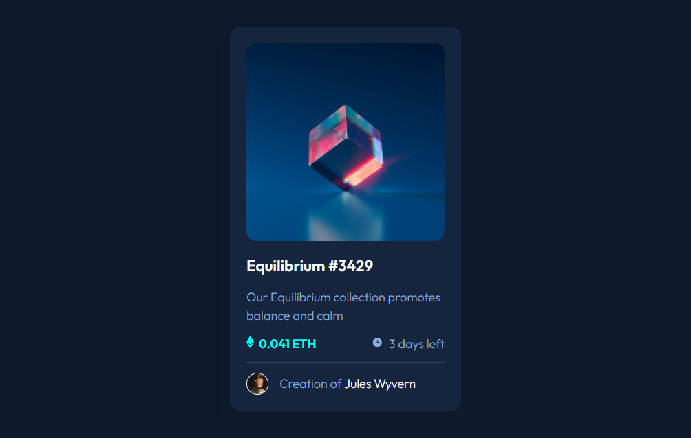

# Frontend Mentor - NFT preview card component solution

This is a solution to the [NFT preview card component challenge on Frontend Mentor](https://www.frontendmentor.io/challenges/nft-preview-card-component-SbdUL_w0U). Frontend Mentor challenges help you improve your coding skills by building realistic projects.

## Table of contents

- [Overview](#overview)
  - [The challenge](#the-challenge)
  - [Screenshot](#screenshot)
  - [Links](#links)
- [My process](#my-process)
  - [Built with](#built-with)
  - [What I learned](#what-i-learned)
  - [Continued development](#continued-development)
  - [Useful resources](#useful-resources)
- [Author](#author)
- [Acknowledgments](#acknowledgments)

## Overview

### The challenge

Users should be able to:

- View the optimal layout depending on their device's screen size
- See hover states for interactive elements

### Screenshot



### Links

- Solution URL: (https://www.frontendmentor.io/solutions/nft-preview-card-component-rKp_Cr8qhw)
- Live Site URL: (https://phenomenal-squirrel-91525f.netlify.app/)

## My process

1. Plan and outline the website
2. Set up the project
3. Add HTML5 semantic tags
4. Add CSS custom properties
5. Use Flexbox for layout
6. Style the website
7. Add hover transition for links
8. Test and refine
9. Deploy the website

### Built with

- Semantic HTML5 markup
- CSS custom properties
- Flexbox
- CSS ::before Selector
- CSS Transitions
- CSS :hover Selector

### What I learned

1. Using CSS ::before selector

```css
.card .card-img .card-img-container .view-icon::before {
  content: "";
  position: absolute;
  top: 0;
  left: 0;
  background: var(--cyan);
  width: 100%;
  height: 100%;
  border-radius: 15px;
  opacity: 0;
  transition: opacity 0.5s ease;
}
```

2. Using CSS transitions

```css
.card .card-img .card-img-container .view-icon img {
  opacity: 0;
  transition: opacity 0.5s ease;
}

.card .card-img .card-img-container .view-icon:hover img {
  opacity: 1;
}
```

3. Using CSS :hover selector

```css
.card .card-img .card-img-container .view-icon::before {
  opacity: 0;
  transition: opacity 0.5s ease;
}

.card .card-img .card-img-container .view-icon:hover:before {
  opacity: 0.5;
}
```

### Continued development

As of the writing of this section, I have no areas that I want to continue focusing on more in future projects.

### Useful resources

- [How To Create Image Hover Overlay Effects](https://www.w3schools.com/howto/howto_css_image_overlay.asp) - This helped me to know how to create image hover overlay effects.

## Author

- Frontend Mentor - [@erlanggaadptr](https://www.frontendmentor.io/profile/erlanggaadptr)

## Acknowledgments

I want to give a hat tip to W3Schools for providing guide on how to create image hover overlay effects.
